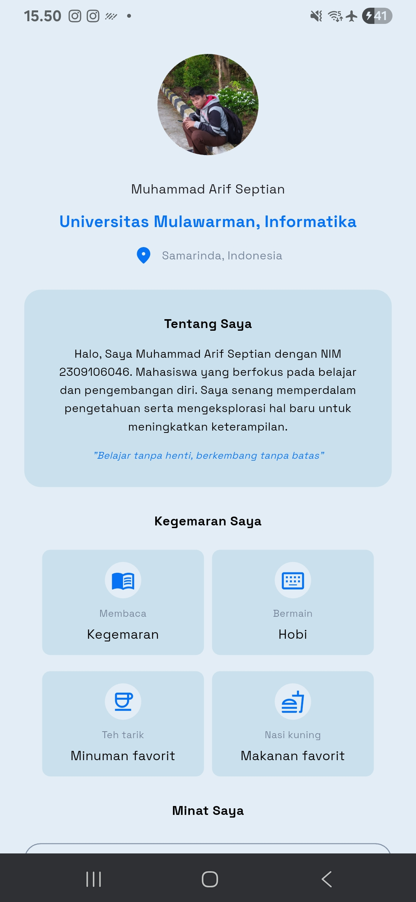

# Aplikasi Profil

Aplikasi Flutter sederhana untuk menampilkan profil saya dengan tampilan modern.

---

## Identitas
- **Nama**  : Muhammad Arif Septian
- **NIM**   : 2309106046

---

## Screenshot
Tampilan aplikasi:


  



---

## Fitur
- Menampilkan informasi saya.
- Menggunakan basic layout flutter seperti column dan row.
- Reusable widget yang bisa dipakai di bagian lain aplikasi.
- Menggunakan stateless widget.

---

## Dependencies
Aplikasi ini membutuhkan beberapa dependency untuk mendukung fitur:

- **flutter** → framework utama untuk membangun aplikasi Flutter.
- **google_fonts** → digunakan untuk menampilkan font `Space Grotesk` pada teks badge.

### Tambahkan di `pubspec.yaml`
```yaml
dependencies:
  flutter:
    sdk: flutter
  google_fonts: ^6.3.1
